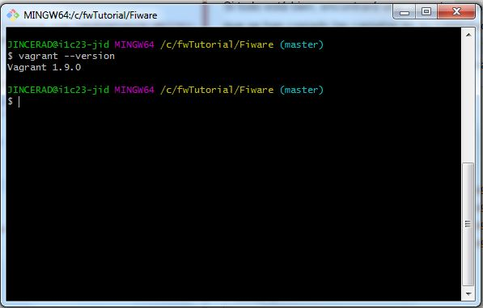

# Tutorial Fiware - Orion Context Broker. Instalación

El objetivo de este tutorial es dar una idea básica del flujo de datos típico al implementar aplicaciones inteligentes que utilicen información obtenida de diferentes medios como sensores, usuarios de dispositivos móviles, etcétera. 

En Fiware, para que las aplicaciones puedan obtener esa información, un componente esencial es el Orion Context Broker (**OCB**). Orion Context Broker es una implementación de la API NGSI (*Next Generation Service Interface Context Enabler*) que permite manejar y asegurar la disponibilidad de la información obtenida del contexto donde se encuentra el objeto (el sensor). 

## Prerrequisitos

### Equipo
- Computadora personal con 8GB de RAM o, si se trata de un equipo Windows, preferentemente con 12 GB de RAM
- Espacio en disco duro de al menos 16GB para las máquinas virtuales
- Procesador iCore 5 en adelante o equivalente

### Programas requeridos
**NOTA: Se sabe de una incompatibilidad entre la última versión de Vagrant y la de VirtualBox. Se debe instalar Vagrant 1.9.x con una versión de VirtualBox 4.0 a 5.1.x**

* [VirtualBox](https://www.virtualbox.org/)
* [SSH](https://www.openssh.com/)
* [Vagrant 1.9.0](https://www.vagrantup.com/)
* [Git](https://git-scm.com/)
* [Insomnia](https://insomnia.rest/) (o cualquier cliente REST). Una herramienta útil puede ser [postman](https://www.getpostman.com/)

El OCB está configurado en un contenedor dentro de una máquina virtual con sistema operativo CentOS. Para evitar problemas de compatibilidad entre versiones tanto del OCB como de CentOS, utilizaremos `Vagrant` y, dentro de la máquina virtual, `docker`. 

Vagrant toma imágenes de un repositorio centralizado (Atlas). Lo cómodo de Vagrant es que se configura el ambiente  de manera muy sencilla a través de un archivo (`.Vagrant`).

## Instalación del Orion Context Broker
Para iniciar la instalación  se requiere abrir la consola, en el caso de Linux o Mac se utiliza la terminal pero para Windows se debe de utilizar la terminal de `git bash`.

En este tutorial se asume que se tiene una computadora Windows 7.

**1.-** Descargue en instale `git-bash` con todas las opciones por default. Lance el programa; verá una ventana como la siguiente:


**2.-** Elija dónde desea instalar las máquinas virtuales, por ejemplo, `fwTutorial`.  Desde la ventana de terminal ejecute los siguientes comandos:

```bash
$ mkdir fwTutorial
# Cambiar de directorio
$ cd fwTutorial
# Bajar estructura de las máquinas virtuales
$ git clone https://github.com/jincera/TutorialOCBFiware.git
```
Si todo está bien, encontrará una carperta `TutorialOCBFiware` y dentro de ésta, dos carpetas más.  Verifique que se han copiado las carpetas en su computadora.  Revise el contenido de la carpeta `vm-fiware-orion`. Debe tener el archivo de configuración `Vagrantfile` y un archivo `init.sh` el cual tiene una serie de comandos que se ejecutarán al levantar vagrant y que ayudan a configurar el ambiente.

```bash
# Cambiar al directorio Fiware
$ cd TutorialOCBFiware
# Listar los contenidos
$ ll
total 0
drwxr-xr-x 1 fwuser 1049089    0 nov 21 09:45 vm-fiware-consumer/
drwxr-xr-x 1 fwuser 1049089    0 nov 21 09:45 vm-fiware-orion/

$ ll vm-fiware-orion/
total 8
-rw-r--r-- 1 fwuser 1049089 2713 nov 21 09:45 init.sh
-rw-r--r-- 1 fwuser 1049089 3632 nov 21 09:45 Vagrantfile

```
**3.-** Si no lo ha hecho, instale VirtualBox desde [http://download.virtualbox.org/virtualbox/5.1.30/VirtualBox-5.1.30-118389-Win.exe](http://download.virtualbox.org/virtualbox/5.1.30/VirtualBox-5.1.30-118389-Win.exe).

**Si está utilizando Windows 10** también deberá agregar el `VM VirtualBox Extension Pack` desde [http://download.virtualbox.org/virtualbox/5.1.30/Oracle_VM_VirtualBox_Extension_Pack-5.1.30-118389.vbox-extpack](http://download.virtualbox.org/virtualbox/5.1.30/Oracle_VM_VirtualBox_Extension_Pack-5.1.30-118389.vbox-extpack).  Descárguelo, ejecútelo y permita su instalación.

**4.-** Instale Vagrant **Recuerde que debe instalar la versión 1.9.x**. La versión 1.9.0 se encuentra aquí: [https://releases.hashicorp.com/vagrant/1.9.0/vagrant_1.9.0.msi](https://releases.hashicorp.com/vagrant/1.9.0/vagrant_1.9.0.msi).

La instalación de vagrant le pedirá reiniciar su computadora.  Hágalo.

Abra nuevamente una terminal de git y confirme que vagrant se ha instalado y que es la versión correcta con el comando `vagrant --version`.



**5.-** Vamos a lanzar vagrant para instalar la máquina virtual con CentOS.  Esta operación puede tomar algunos minutos pues además del sistema operativo, se instalan varios paquetes adicionales.

```bash
# Asegúrese de que se encuentra en la carpeta de vm-fiware-orion
$ pwd
/c/fwTutorial/Fiware/vm-fiware-orion
# Lance vagrant
$ vagrant up
Bringing machine 'default' up with 'virtualbox' provider...
...
...
==> default:   mongodb-org-tools.x86_64 0:3.4.10-1.el7
==> default:
==> default: Complete!
```

Ahora entramos a la máquina virtual con el comando:

```bash
$ vagrant ssh
```

Si todo está bien, encontrará un archivo `docker-compose.yml` con la siguiente información:

```bash
$ vagrant ssh
fiware-sdk:~
$ ll
total 12
-rw-r--r--. 1 root    root     150 Nov 21 16:35 docker-compose.yml
drwxr-xr-x. 4 vagrant vagrant   79 Nov 21 16:39 fiware-orion-subscriber
-rw-r--r--. 1 root    root    7073 Nov 21 16:38 jdk-8u111-linux-x64.rpm
fiware-sdk:~
$ cat docker-compose.yml
orion:
  image: fiware/orion
  links:
    - mongo
  ports:
    - "1026:1026"
  command: -dbhost mongo
mongo:
  image: mongo:3.2
  command: --nojournalfiware-sdk:~
```

En el archivo vemos que se instalarán Orion Context Broker y mongoDB y ahí se define cómo se comunican entre ellos. 

Hay que lanzar el docker desde la carpeta donde está ese archivo.  Al lanzar el comando `docker-compose` por primera vez, tomará mucho tiempo porque se están descargando las imágenes de la máquina virtual y todos los elementos necesarios para crear el ambiente. 

```bash
$ docker-compose up -d
Pulling mongo (mongo:3.2)...
3.2: Pulling from library/mongo
....
Creating vagrant_mongo_1 ... done
Creating vagrant_orion_1 ...
Creating vagrant_orion_1 ... done
fiware-sdk:~
```

Si todo se ha instalado correctamente, ya tiene una instancia de Orion Context Broker ejecutándose.  Para comprobarlo, lance un navegador (en su sistema operativo nativo) e invoque la página con el URL `127.0.0.1:1026/version`. Deberá ver lo siguiente:


Alternativamente, puede utilizar el comando curl desde la terminal git

```bash
$ curl http://127.0.0.1:1026/version
{
"orion" : {
  "version" : "1.9.0-next",
  "uptime" : "0 d, 0 h, 2 m, 43 s",
  "git_hash" : "dfc83adf1803983cc3fa2fc69de93ab6acdf15c4",
  "compile_time" : "Tue Nov 21 11:57:02 UTC 2017",
  "compiled_by" : "root",
  "compiled_in" : "d943ae1d7025",
  "release_date" : "Tue Nov 21 11:57:02 UTC 2017",
  "doc" : "https://fiware-orion.readthedocs.org/en/master/"
}
}
fiware-sdk:~
```
**¡FELICIDADES!** Ya tiene un OCB listo para recibir atributos de entidades. En el tutorial aprenderemos a interactuar con el OCB desde una aplicación REST.

Por ahora no utilizaremos el OCB.  Sálgase del ambiente y detenga la máquina virtual:

```bash
fiware-sdk:~
$ exit
logout
Connection to 127.0.0.1 closed.

fwuser /c/fwTutorial/TutorialOCBFiware/vm-fiware-orion (master)
$ vagrant halt
==> default: Attempting graceful shutdown of VM...
```

# Instalación de un suscriptor

Para comprender cómo un componente puede suscribirse al OCB y recibir notificaciones relacionadas con alguna entidad, levantaremos la instancia de un suscriptor muy sencillo desplegado por el equipo de [INFOTEC](https://www.infotec.mx/) en el que únicamente se desplegará en una página Web cierta información.

Con el fin de tener todo listo para el tutorial, vamos a configurar una segunda máquina virtual.

**1.-** Si detuvo la VM con el OCB, abra una segunda terminal de git (`ALT-F2`) y navegue hasta el directorio `vm-fiware-consumer`:

```bash
$ cd c:/fwTutorial
$ cd TutorialOCBFiware/vm-fiware-consumer/
# veamos el contenido
$ ll
total 8
-rwxr-xr-x 1 fwuser 1049089 2314 nov 22 18:24 init.sh*
-rw-r--r-- 1 fwuser 1049089 3155 nov 22 18:24 Vagrantfile
$
```

Al igual que en la instalación del OCB, ejecute el comando `vagrant up` para crear la máquina virtual. Por ser la primera vez que instala esta VM, el comando tomará algunos minutos
```bash
$ vagrant up
Bringing machine 'default' up with 'virtualbox' provider...
==> default: Importing base box 'centos/7'...
==> default: Matching MAC address for NAT networking...
==> default: Checking if box 'centos/7' is up to date...
...
...

```

Una vez creada, hay que entrar a la máquina virtual, configurar la variable de ambiente `JAVA_HOME`, y verificar que el suscriptor se ejecuta:

```bash
# conectar a máquina virutal por medio de SSH
vagrant ssh
## Ya dentro de la máquina virtual
# Cambiar JAVA_HOME
export JAVA_HOME=/opt/jdk1.8.0_151
# Iniciar suscriptor
/opt/maven/bin/mvn -f fiware-orion-subscriber/pom.xml spring-boot:run
...
[INFO] ------------------------------------------------------------------------
[INFO] BUILD SUCCESS
[INFO] ------------------------------------------------------------------------
[INFO] Total time: 13:31 h
[INFO] Finished at: 2017-11-23T15:32:24+00:00
[INFO] Final Memory: 20M/48M
[INFO] ------------------------------------------------------------------------
```
**¡Muy bien!**  El ambiente está listo para poder realizar el tutorial.

Detenga el suscriptor, salga de la máquina virtual y apáguela.

```bash

$ exit
$ exit
logout
Connection to 127.0.0.1 closed.
$ vagrant halt
==> default: Attempting graceful shutdown of VM...
```


